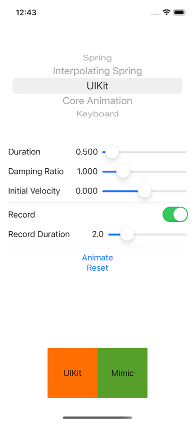

In this project, we demonstrate the formula of spring animation in iOS.

In the interface, there are two views below. The left one is animated by system API, the right one is animated by keyframe API where the positions are provided by a custom formula. You should see the two are very close in most cases.

The main formula of the spring is in SpringCurve.curveFunc of [SpringCurve.swift](RevealSpringAnimation/Math/SpringCurve.swift).

Some calculation is inspired by [Framer](https://github.com/koenbok/Framer/blob/master/framer/Animators/SpringCurveValueConverter.coffee)
